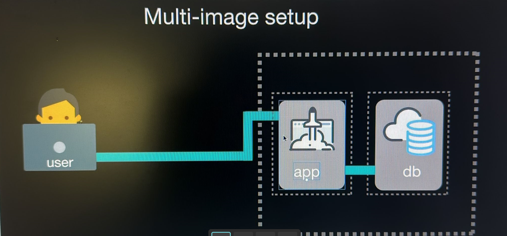

Multi Conatiner Scenario:

Now give the DB connection link (In our case the place mondodb installed and the port number you are allowing to flow)
Now tha pplication is build and so we need to contain this application in Docker Container.

Containerizing of the build application:

We will betetr solution using docker ignore file (.ignore file) we can put the names, files folders into it and so it will ignore it.
We will mention all the files that we will ignore. while the containerizing is starting it takes looks first into .dockerignore file and ignores everything written in that file.
Now, we will create our own docker file to containerize the application.

We will first copy the base image from node, Alpine.
Give the working directory
Copy package.json filr from working directory of local to working directory of conatiner .
Now run npm with RUN npm install
Now, copy all the directories from local to container.
Later, we will have default comment with array of strings.

DOCKER COMPOSE:

It is tool for defining and running multi container docker application. We use yaml(.yml) file to configure the application services.

(docker-compose up -d : to start up that compose
 ./run_tests
 docker-compose down) : to turn down the compose.

NOTE: 
Make sure to remember, whatever you write in docker completely run in the same way, you write them. Indendation is also much important in docker-compose world.