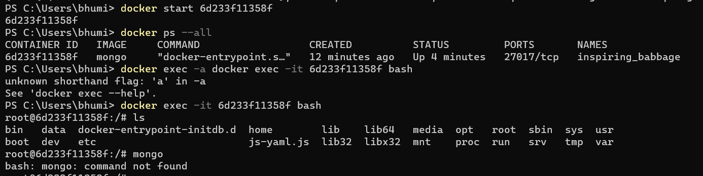
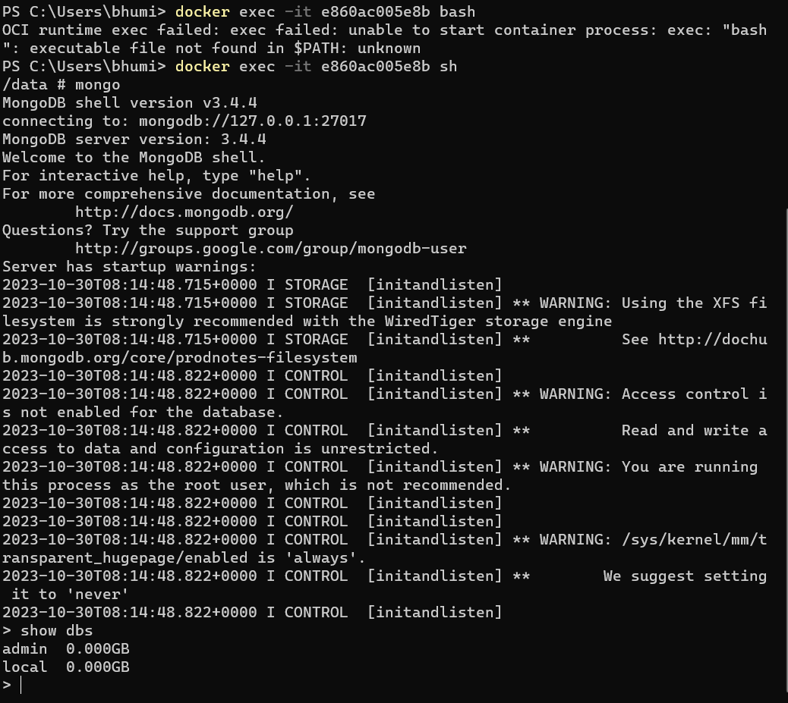

DOCKER

    PROBLEM STATEMENT: 
    When you design a project and works completely fine on your machine and keeps failing on the colleagues machine, the project usually fails to run, when moved from one place to other, irrespective of the language.
    Problem is, debate starts and developer says evrything is fine and colleague comes with diffferent scenarios for possibility of failure.

    To resolve this, Docker comes into picture.

    Docker is designed to address isuues "that works on my machine". It is like a shaeet(you can put whatever you want) which is compatible with anything. This contains everything you put and so with the data given it works everywhere and same at every machine.
    It is also known as social containers, it allows you to share the containers just as your social media things.

    Docker containers are the one which has a package including of 
    -- Code
    -- dependencies
    -- configurations
    -- process
    -- Networking
    -- OS and many more.

    Docker is client side application.
    This is a service and can be deployed on any server...

What is Docker?

    Docker is nothing but a platform, which implements the concept containerization. containerization in simple words is nothing but the process of containers form and work.

Docker Architecture:

    Docker Lifecycle :

    We create a docker file, by filling the required things from template.
    With the help of BUILD command, docker image is created.
    Image is further converted to docker container, with running RUN command.
    Once the conatoiner is created, we push that to public/private registries.

DOCKER Installation:

    *Create Account - go to docker.com --> create an account 
    *Download Docker - download docker for windows
    *Install Docker - double click on the downloaded file and instal.to have docker up and running - go to start button and search for Docker --> Open the downloaded application for desktop,then sigin again with the credentials account was created to have Docker up and running.
    *Verify - Go to your git bash/power shell and run commands Docker and Docker version. It should give you some Information.

    Hola! you have docker downloaded and installed. Which is up and running.

    
    Now we will try to run hello world on docker.

    We can find official image of hello world in docker hub (https://hub.docker.com/_/hello-world). With this we could directly use docker pull hello-world. 
    But we are not going to do that insted, we will do as before docker run hello-world.

    
    
    We remember at the first try we got failure message as included in the message above, we will discuss regarding this after a bit.
    Now, lets try running it again, the same command.

    

    It suceeded now, running the hello world. How ? docker client simply contacts the docker hub if the hello-word image is existing because it didn't find it in local, if yes, then it pulls that image and forms a container and displays it to us with the help of docker client.

What is container in Docker:
    Hardware + OS + Kernel + system applications + Application

    Some part of everything above is called container. to save some dependencies such as previous versions, such as secuity thinga, namespaces etc.

VM vs Docker
 
    VM : A layer of hypervisor is setup and has the seperate (entire OS, config files and App) lot of packages combined together. It has set up virtually for use in cloud. But the only downside is it doesn't have ability to upgrade/downgrade resources based on requirement. Which has been adding a lot of cost on the users at non-utilizing time.

    

    Docker: It is almost similar to virtualization, but it has pack of (hyperviser, OS from server/VM, Docker and container with only mandatory files for system execution from linux but not whole OS).

    

Docker Image: 

    It is basically of 2 layers 
    1) Config/file - This can be captured by snapshot feature provided by Docker. Also eco system on which we write our application.
    2) Default commands - for exmample we worked on hello-world, there is some basic command which helps us throughing that back.

    We will try to explore Busybox from hub.docker.com, which is official image. It basically has UNIX utilities as shown in image.

    

    

    The below image displays all the files that busy box contain, these are the files we get along with pulling of busybox.

    

    ------------------------------------------------------------------------------------------------------------------------------------
FUNDAMENTALS OF DOCKER:

    In our previous sessions we pulled busy box and ran hello world on Docker, we also want to know which all are still runnings and consuming our resources.

    For the same, we use commands
    1) Docker ps
    2) Docker ps -all

    

    Each of the colum in the given list has its own signficence such as 

    1) Container ID  -  Unique 
    2) Image -  Name of image we pulled.
    3) Commands  -  Commands used for those
    4) Created  -  Time, at which we ran.
    5) Status  -  Created/Started/paused/Exited/Dead (Commands: Docker create/start/pause/unpause/stop rather than these we could use docker run) and time.
    6) Ports  -  You could provide the port numbers there to allow traffic.
    7) Name  -  We get some bizzare names for every conatiner ID.

    Docker lifecycle has 3 main parts we already discussed, file --> image --> container

     -- Detailed description of lifecycle.

    We could play with commands to move images to different stages between created --> Dead.

    For example if we have a image in state EXITED we could bring back any of the other states in the process.
    

    

    Deleting an image could be done using the command - docker system prune.

    *********************************Whatever is happening in docker is inside its container, the world outside conatiner doesn't know whats happening inside the container and also can't interact with container, unless it is mentioned.******************************

    -it -- is something we use crazily, it is used to go inside and come out of container. 

    Now we will see how to instal MongoDB:

    To see all the DB's present in MongoDB we use command - show dbs

    To install mongodb we have to go the docker hull and search for appropriate image and then pull that image. 
    We can use command RUN --> docker run mongo (docker pull mongo) 
    Note: The difference between run and pull is, run means after the client request docker deamon search it in the default, if that is not existing it goes to the help from docker hub and pulls it from there. Where as pull by default takes it from docker hub rather than checking locally.

    Now you need to interact with the container, to go into it and do something. We already know we can't interact with the container and so now we take help of command "-it" to interact with conatiner. We use below command

    docker exec -it 6d233f11358f(this is ID) bash  --  Taking the whole bash shell inside the container.

    Which gives us way to interact with container and see for necessary things. Using this we will be into the specific container for which ID is provided and now we could execute things inside container.

     - Inside container we could do "mongo" we will see mongo shell will be running and so we could also use command "show dbs". To come out of container we use command "ctrl+d".

    How to stop the image, to not make image consume the resources when not in use ? We have couple of ways
    1) docker stop id  -  use it mostly, it is better way, because it stops rather than killing anything.
    2) docker kill id 

     - After using the stop commands the container goes into exited state. 

    exec commands:

    We will have a container and inside container, we ill be having bash where we interact with mongoDB in our case.
    In -it, -i stands for input and output  and -t stands for formatable terminal.

    Multiple ways to get into Container:
    
    There are majorly 2 ways :
    1) start ID --> do docker ps --all --> Using -it with container ID bash : It takes us into container. (docker exce -it ID bash)
    2) Start the container --> enter conatiner at runtime --> docker run -it mongo bash.

    Please remember anything giving to mongo or particularly to any image with "-it" is default/override command. Which that image need to follow.
    So, in our case  docker run -it mongo bash (bash is override command). This is the reason it is not suggested to follow method-2 by running a single command you are entering into bash of the conatimer, rather than using 3 commands as in method-1.

    method-1 >>>>>>>> method-2. Because there are some dependencies that run for every image at runtime and we don't want to overrie them using run command.

    How to poke into container multiple times ?

    SCENARIO:
    Lets take 2 Instances of mongoDB, which would be 2 different containers and perform commands with 1st instance - enter into container and bash, then create a file yourname.txt. Follow the same process for 2nd Instance with file name whatsapp.txt, when we do ls on both the instances different times inside the bash, what will be the o/p?

    ANS: When we do ls inside the bash of 1st container we see many files along with harsha.txt, but whatsapp.txt doesn't exist in it. Because both are different containers.
    In the same way, When we do ls inside the bash of 2nd container we see many files along with whatsapp.txt, but not harsha.txt

   ====================================================================================================================================

CREATION OF CUSTOM DOCKER IMAGES:

    We will now create the customized image of MongoDB, Installing a software on linux machine?

    We are installing postman today!
    1) Install OS - windows, linux etc
    2) Install a browser
    3) Google Postman - exact link to download 
    4) Download postman
    5) start installation
    6) Figure out dependencies - that need to be in place before installing required application
    7) Instal those dependencies
    8) Restart postman Installation
    9) Place shortcut icon
    10) Finish

SCENARIO:

    This analogy will be written in docker file. We will see how we take all this into docker file ?
    MongoDB is service and DB. First we will create a smaller image for just starting up and we will also look into base image.

    Whenever a new instruction is loaded in docker file, it means a temporary container is created and everything is executed there and  then a new image is created with adding that instruction as a base image.

    We already saw in our case that we are installing binutils and alphine(OS) already know from where we need to run that. If the OS doesn't know we will see how it could be done.
    We will it as error and solve that.

    create file and run BUILD command(docker build .) to convert it to image and run that using RUN command (docker run <sha>)
    How to verify if the something is running on given port ? Use docker ps to see if something is running.

    Steps: 

    mkdir <name>  -  mkdir mymongo-image  -  Create a empty folder with the name
    cd mymongo-image
    ls - check if the created folder is present
    code . - I have used VS code to write a docker file and run terminal.

    After creating of file: 

    We need to use build command to convert it to image and then run/start command to create a container
    file -- build --> image -- run --> container

    docker build .
    docker run <sha> / docker start <sha>

    

    By now own mongodb should be up and running, now we have to create a new terminal and check the running and created containers, using docker ps command. then we will have list of containers and so our mongod.
    Now using that ContainerID we enter into the bash/shell of linux using command docker exec -it containerid bash / docker exec -it containerid sh.

    ctrl+N
    docker ps
    containerid bash / docker exec -it containerid sh

    By now you will be into shell/bash and now you could use below commands

    mongo
    showdbs
    

    CONCEPT OF CACHING IN DOCKER:

    If this is like creating image layer for every instruction but creating a new conatiner and move that into cache. If the same application with same set of instructions in same order is run then the docker uses the cache memory to run them again. 
    Lets assume if we create the instructions of same order but include a new instruction between, then the docker uses cached memory till the new instruction and then runs the new layer of images from that instruction.

    PROVIDING CUSTOM NAME FOR IMAGE:

    we can run a image with using the command (docker run <sha id>). We could also give a name to docker container, so lets name our image using command (docker build -t username/name:versionno) (docker build -t harshakonakalla/harshamongo:v1.0).

    
